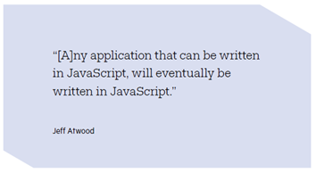

# Mastering Javascript
 Learning Path to Learn Javascript | With Gun

# Table of Contents

- [ ] Mastering Javascript
- [ ] Data Types
- [ ] Control Flow
- [ ] Loop & Iteration
- [ ] Function
- [ ] Error Handling
- [ ] Object
- [ ] Classes
- [ ] Collection

# Javascript

Javascript is an Interpreted Language.

Historically, javascript was used to make a web page more interactive.

Javascript is a programming language that belongs to the script language category, scripting requires an interpreter program to be understood by computers. When we execute javascript code in a browser, an interpreter in the browser will translate the Javascript into a machine code. However, currently most browsers already use a javascript runtime engine that supports JIT Compilation.

Machine code is a language that is understood by computers. Machine code is a string consisting of the binary numbers 1(s) and 0(s). The analogy is like converting English into Indonesian so we can understand. It's just that in order to be understood by the computer Javascript must be interpreted (translated) using a program called interpreter in the browser every time we execute a Javascript code.

Javascript is one of the most popular programming languages in the programming world. The javascript language is a versatile language because it can be used to create:

1. Web Application
2. Decentralized Applications (dApps)
3. Application Server
4. Desktop Application
5. Mobile Application
6. Embedded System

This means that we can have great potential and opportunities if we want to learn and explore it, the javascript language has a very wide range of implementation.

Before writing this book, I had read an interesting quote about javascript in a magazine.

